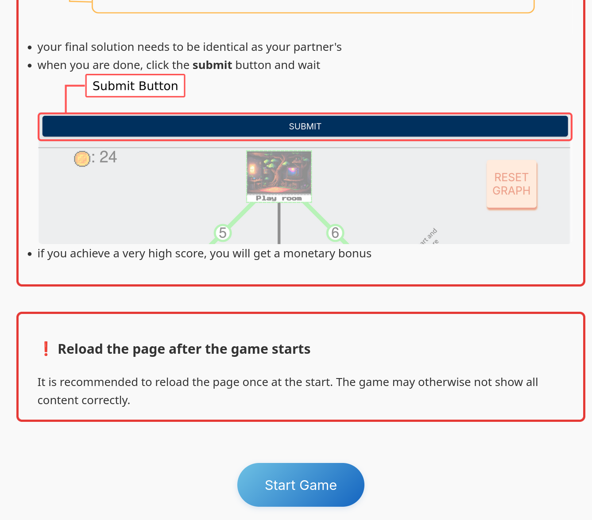
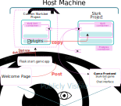

 # Setting up the Slurk Server and Sailsman Bot

 <!-- ## The aim of this section: Setting up an online slurk-based dialogue game -->
 There is already an existing [official documentation](https://clp-research.github.io/slurk/) to set-up the slurk server. However, understanding the infrastructure and publicly deploying the server remains confusing even after thoroughly reading through the documentation.

 The aim here is to guide through a setup process that uses the slurk-docker container as frontend and connects the sailsman bot, which shall serve as the game's backend. We will also share our insights into how we deployed this game publicly, in the hope that this may help someone on a similar endeavor at some point.
 
 ## A quick overview

 
*An example welcome page to start the dialogue game*

The project will roughly have the following structure:\
The *host*, *machine* or *virtual machine* will refer to the machine that everything will run on, basically the computer that the project is hosted on. This machine will ultimately need a domain, such that it can be accessed publicly.

The slurk server will be run as the frontend of the game, connected to a database to store log-data of the game. The server mainly handles signals between two players and displays the chat interface, as well as the dialogue game.
Confusingly, the slurk-bot is not really a bot, but rather a game-backend. It should be thought of as the game logic which runs in the background. Technically this could involve an AI agent, so I guess in that case we could in some way refer to it as a "bot".
<!-- thatThis means that the backend could also handle a "bot instance" and send signals of that AI-instance to the user, but it should be rather thought of as a game logic that runs in the background. -->
Both, the slurk server and database will be seperate docker-containers, essentially seperate machines that run on the host. Since all docker-containers are virtually their own machines, they will communicate through their ports. This may seem wonky at times, although it will probably not be of a big focus in this setup.


*A sketch of the final infrastructure for a running slurk dialogue game. The minimal setup for local development purposes can be reduced to only the slurk-bot container, as well as the slurk container.*

The above graphic depicts an overview of a working deployment to run the game online. This guide will focus on the recreation of starting the slurk-bot, the slurk server (the chat interface and frontend), as well as a connected postgres container (which will turn out to be relatively easy).

There are more resources on how to expose the resulting frontend to the public in the end. Here, this will only be rougly sketched, if time permits.

## Download or clone all necessary files
First, we will need the slurk project, as well as the slurk-bots project, which are both needed and helpful to run our own custom bot, in our case a traveling-salesman game.

**clone the slurk server project repo**:
```shell
$ git clone git@github.com:clp-research/slurk.git
```

**clone the slurk-bots project repo**:
```shell 
$ git clone git@github.com:clp-research/slurk-bots.git
```
**clone the sailsman-game project repo**:

Lastly, for the traveling-sailsman game, go into the slurk-bots repository and clone the sailsman repository:
```shell
$ cd slurk-bots
$ git clone git@github.com:coli-saar/sailsman-game.git
```
This project uses Git submodules. After cloning, run:
```
$ git submodule update --init --recursive
```

**Setting up the project with helper files and scripts**:

A python script to start the bot using podman will be located in `sailsman-game/setup-scripts/`. Copy it into the `slurk-bots/` folder:

```shell
$ cp slurk-bots/sailsman-game/setup-scripts/start_bot_podman.py slurk-bots/
```

The sailsman-game repo includes additional files for easier deployment in `setup-scripts/server-setup/`. In order to easily deploy the slurk-server alongside the databse, we will be using a docker-compose file that can be found there. For easier access, move the file to the project folder, alongside the `slurk/`, `slurk-bots/` folder:

```shell
$ cp slurk-bots/sailsman-game/setup-scripts/server-setup/docker-compose.yml
```

There are also some additional helper scripts, allowing easier startup of the bot and container management in `setup-scripts/server-setup/scripts`. Copy these files to the project folder:
```shell
$ cp -r slurk-bots/sailsman-game/setup-scripts/server-setup/scripts/ .
```

### Installing dependencies
[Install conda](https://docs.conda.io/projects/conda/en/latest/user-guide/install/linux.html) for virtual python environments.\
Create and start a conda environment:
```shell
$ conda create --name [name_of_environment] python=3.9
$ conda activate [name_of_environment]
```

Install requirements:
```shell
$ cd slurk-bots/sailsman-game/
$ pip install -r ./requirements.txt
```

[Install podman](https://podman.io/docs/installation) to handle containers. For fedora run:
```shell
$ sudo dnf install podman
```
>[!Note]Instead of using podman, the same can be done using docker. For this, the namespace of some files needs to be changed: whenever any command sais podman, simply change it to docker throughout this setup and files.

>[!TIP] It is recommended to install and use screen to run the slurk server on (the podman-compose command, see below).

 # Starting the Bot on the Server

 ## Starting the server
 Once the above setup is completed, from the project folder (where the docker-compose.yml is located), simply run:
 ```
 podman-compose up
 ```

 >[!NOTE] I had issues when just runnging this command on the server. It has shown to best when run on a screen session.

 > [!IMPORTANT]
 > After running the command, it will give you an admin token, which is necessary to connect the bot to the server. It is recommended to save this token somewhere for easier access, as otherwise you'd always have to go back to this shell to copy it. The easiest setup would be to copy it into the start_sailsman.sh script to have it permanently available:
#### Slurk Admin Token
In theory, upon every start of the bot, one could pass the slurk admin token, which is listed in the output of the podman-compose. To make things easier, we are using a start-up script, which is available in the `scripts/` folder, which we copied from the `sailsman-game/` repo above. Simply copy the admin-token and paste it in `line 29` of the `start_sailsman.sh` script after "--slurk-api-token" (overwrite the old token for it).


## Starting the bot
Once the slurk server is running, the simplest way to start the bot is to run:
```
$ conda activate [name_of_environment]
$ cd slurk-bots/
$ ../scripts/start_sailsman.sh -ip
```
from the `slurk-bots` folder. This will start the bot with 2 users. Tokens, room and task information are put into tokens.txt in the `home/` folder.

> There are useful flags for development and for the single player version (with LLM), see `-h` for more information.

> Admin Token: The slurk-admin token is hard coded in the start_sailsman script. Usually it needs to be collected from the logs of the server: `podman logs slurk_slurk_1`, see section 'Slurk Admin Token'

# Additional tips
## Downloading logs

### sailsman logs
Go into ```slurk-bots```
then run 
```
python download_logs.py --task_id $TASK_ID --token $SLURK_API_TOKEN --output-dir ../logs
```

### LLM logs
To download the LLM logs, the respective bot-container must still be running. In order to get the logs, first get the containers name, then run the `get_llm_logs.sh` script:
```
$ podman ps
```
$\rightarrow$ copy the container name
```
$ scripts/get_llm_logs.sh <container_name>
```
> logs are saved in ```logs/tsp-agent-logs```


### Cleaning running dockers
There are scripts in the ```scripts``` folder to stop and remove all containers, except the running server.
To stop and remove all running bots, run:
```
$ scripts/cleanup_container.sh
```
To remove images (advisable, after starting a few bots, as concierge bots accumulate over time.):
```
$ scripts/cleanup_images.sh
```
# Running games as web-application
This is definitely not the best but a working setup to run the dialogue game as a web-game. We will use a simple index.html, a start page, which gives an overview of the game - essentially an instruction or tutorial page. From this page, the user will be able to start a game, to which they will be redirected. A rough structural outline can be seen in the project sketch in **A quick overview**.

The index.html corresponds to the welcome page and besides its introductory content it really only serves the purpose of starting a game. We will achieve this through a simple flask app "start_sailsman_api", wich will be running on a screen session. The flask app will simply run our `start_sailsman.sh`, which we already set up to work above.

In order to make all these functions available, the approach we'll be using here is as follows:

- At the root of our domain (i.e. slurk.dialogue-game.com/), we will run the slurk game.
  >[!NOTE] Given the structure of the slurk project it has turned out to be very difficult to open the slurk game at any other path except for the root.
- At the `/start/` path (i.e.slurk.dialogue-game.com/start/), we will host the index.html, the welcome page.
- At the `/start-game/` path (i.e.slurk.dialogue-game.com/start-game/), we will have our start_sailsman_api listening, such that a simple post start a new container.

All of the above must be set up in a `.conf` file, for example in `etc/httpd/conf.d/`, when using Apache. 
>[!Note] A concrete server setup is beyond the scope of this slurk-server setup guide. There are good resources on how to set up an apache server and the configuration, if not with the help of an LLM.

## Welcome page
We provide an example `index.html` in `sailsman-game/setup-scripts/server-setup`. This file can be simply copied somewhere in `/var/www/`.

### Start Apache Server
> [!Note] This is expecting of course that the apache server and its configuration have been set up properly.
```
$ sudo systemctl start httpd
```

## Start-Game Application
In `sailsman-game/setup-scripts/server-setup` we also provide a `start_site_app/` folder. Move this folder into `slurk-bots/`.


Inside that folder, you will find `start_sailsman_api.py`, which is the Flask server application we used, handling the backend for `/var/www/index.html`. The application handles start-container events, for which sailsman bots are created and started. The application also cleans up containers to keep running containers at a minimum.
<!-- Because the start-sailsman script needs to be run in the `slurk-bots/` folder, this application also needs to be. -->
In order to start it, run the following commands:

```shell
$ cd slurk-bots
$ screen -r {start-game-session}
$ conda activate {python-env}
```
If it is the first time starting, you will need to install the dependencies for flask app:
```shell
$ pip install flask
$ pip install flask_limiter
$ pip install gunicorn
```
After that, execute the app as follows:
```shell
$ PYTHONPATH=/home/slurk/start_site_app/ gunicorn -w 1 -b 127.0.0.1:8001 start_sailsman_api:app
```
>[!note] If there doesn't yet exist a screening session, run `screen -S {start-game-session}` instead.

>[!Note] There will be some errors at first on missing folders for logging. If no logging is intended, the respective lines can of course be uncommented.

>[!IMPORTANT]
> Make sure that in start_sailsman.sh, the correct admin token of the slurk server is used. Also ensure that the correct host/domain is given. The also holds for the start_sailsman_api.py file.

> [!IMPORTANT]
> The slurk server does only allow requests from specific addresses. In order to make the setup work, you will most probably have to add the following argument to SocketIO() in slurk/slurk/extensions/events.py, line 3:\
cors_allowed_origins=['http://127.0.0.1:5000', 'https://{your_domain_name}']
<!-- {start-game-session} will be start_game by default. In case this session does not exist, run `screen -S start_game`. The python environment can be any from the `conda env list` environments. I would recommend using `start_game`. -->
# Additional Notes
## Accessing information from rooms
The `start_bot_podman.py` script posts information to http://127.0.0.1:5000/slurk/api/. It can be handy to look on previous rooms, their ids, task id, user ids, etc.

For example, to look for the number of users that were in a room, run:
```shell
curl http://127.0.0.1:5000/slurk/api/tasks/{task_id}
```

<!-- ### Note
Unfortunately, I didn't yet find a way to get the task id from the room id. -->
